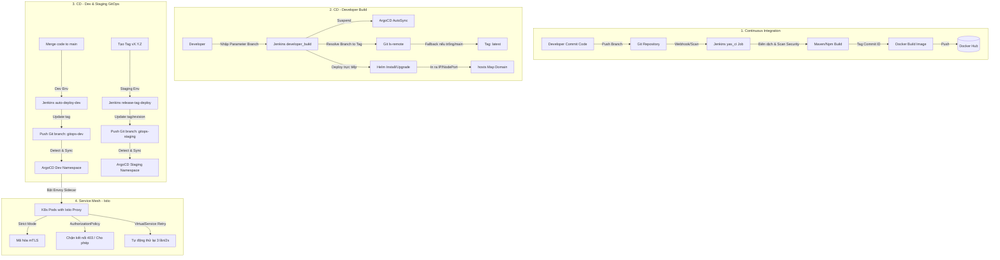

# 📘 CẨM NANG ÔN TẬP VẤN ĐÁP ĐỒ ÁN DEVOPS (CI/CD & SERVICE MESH)
> **Dự án YAS (Yet Another Shop)**
> Tài liệu tổng hợp toàn bộ lý thuyết, kịch bản test, luồng chạy thực tế và bộ câu hỏi vấn đáp thường gặp giúp bạn tự tin đạt điểm tối đa khi bảo vệ đồ án trước các thầy cô.

---

## 🗺️ TỔNG QUAN FLOW CHẠY THỰC TẾ



---

# 📂 CHI TIẾT TỪNG TIÊU CHÍ ÔN TẬP

## 1️⃣ Continuous Integration (CI)
### ⚙️ Cấu hình thực tế trong dự án:
* **File cấu hình:** [Jenkinsfile-yas-ci](file:///c:/Users/Admin/Documents/A-devops/yas/Jenkinsfile-yas-ci) và [Jenkinsfile](file:///c:/Users/Admin/Documents/A-devops/yas/Jenkinsfile) gốc.
* **Cơ chế hoạt động:**
  1. **Checkout SCM & Detect Changed Services:** Jenkins quét qua các commit và chỉ build các service có sự thay đổi về source code (Tránh build toàn bộ 16+ services để tiết kiệm tài nguyên và thời gian - *Incremental Build*).
  2. **Biên dịch:** Chạy `./mvnw clean package` cho các service Java hoặc `npm install && npm run build` cho các Frontend.
  3. **Docker Tag & Push:** Lấy hash Git Commit 8 ký tự cuối cùng (`git rev-parse --short HEAD`) làm tag của Docker image. Ví dụ: `besukem/tax:b4f2a1b9`. Đăng nhập qua credentials của Docker Hub (`dockerhub-credentials`) để push lên repository.

### ❓ Bộ câu hỏi vấn đáp:
* **Hỏi:** *Tại sao lại dùng Git Commit ID làm Tag mà không dùng tag static như `latest` hay `dev`?*
  * **Trả lời:** Dùng Git Commit ID giúp định danh duy nhất (unique) cho mỗi lần thay đổi mã nguồn. Điều này giúp ngăn chặn việc ghi đè lên các bản build cũ, cho phép rollback (quay lại phiên bản cũ) dễ dàng và giúp truy vết chính xác container đang chạy được build từ commit nào trên Git.
* **Hỏi:** *Làm thế nào để Jenkins tự động phát hiện code thay đổi trên Git?*
  * **Trả lời:** Có 2 cách:
    1. Cấu hình **Git Webhook** trên GitHub/GitLab: Khi có push event, Git sẽ gửi 1 HTTP POST request đến Jenkins endpoint để trigger pipeline.
    2. Cấu hình **Scan Multibranch Pipeline** định kỳ (Poll SCM) trong Jenkins để quét xem có nhánh mới hoặc commit mới không.
* **Hỏi:** *Tại sao phải sử dụng cơ chế phát hiện service thay đổi (Detect Changed Services)?*
  * **Trả lời:** Dự án YAS có kiến trúc Microservices chứa nhiều module. Nếu mỗi lần commit 1 file nhỏ mà phải build lại toàn bộ hơn 10 microservices thì rất lãng phí thời gian và RAM/CPU của server Jenkins. Chúng ta dùng lệnh `git diff --name-only origin/main...HEAD` để lấy danh sách file thay đổi, từ đó lọc ra dịch vụ nào bị tác động để chỉ build dịch vụ đó.

---

## 2️⃣ CD - Developer Build (Parameterized & Fallback)
### ⚙️ Cấu hình thực tế trong dự án:
* **File cấu hình:** [Jenkinsfile-developer-build](file:///c:/Users/Admin/Documents/A-devops/yas/Jenkinsfile-developer-build)
* **Cơ chế hoạt động:**
  1. Cho phép lập trình viên chọn deploy lên namespace tùy ý (`NAMESPACE`, mặc định là `dev`).
  2. Cung cấp tham số nhập nhánh cho từng dịch vụ độc lập: `BRANCH_cart`, `BRANCH_customer`, `BRANCH_tax`,...
  3. **Cơ chế Fallback thông minh:** Sử dụng hàm `resolveBranchToTag` để chuyển đổi tên nhánh thành Commit ID tương ứng trên Git (Dùng lệnh `git ls-remote`). Nếu lập trình viên không nhập gì (để trống), hoặc nhập `main` hoặc `latest`, hệ thống sẽ tự động gán tag là `latest`.
  4. Triển khai trực tiếp lên Kubernetes cluster bằng câu lệnh `helm upgrade --install`.

### ❓ Bộ câu hỏi vấn đáp:
* **Hỏi:** *Cơ chế Fallback hoạt động như thế nào và tại sao nó quan trạng?*
  * **Trả lời:** Lập trình viên thường chỉ phát triển và sửa code trên 1 hoặc 2 service (ví dụ: `tax-service`). Khi muốn test, họ chỉ cần nhập branch phát triển của mình vào tham số `BRANCH_tax`. Các service còn lại họ để trống. Pipeline sẽ tự động deploy bản code mới nhất (theo Commit ID) cho `tax`, còn lại các service khác sẽ dùng bản ổn định mặc định là tag `latest` từ Docker Hub. Điều này giúp môi trường test luôn hoạt động hoàn chỉnh mà không cần lập trình viên phải nhập tay tag của tất cả các service khác.
* **Hỏi:** *Lệnh `git ls-remote` trong code dùng để làm gì?*
  * **Trả lời:** Lệnh này giúp Jenkins truy vấn nhanh mã băm commit (Commit Hash) mới nhất của một nhánh cụ thể trên Git Server từ xa mà không cần phải thực hiện git checkout nhánh đó về máy. Điều này giúp tối ưu tốc độ xử lý của pipeline.

---

## 3️⃣ CD - Môi trường Dev & Staging (Với và Không với ArgoCD)
### ⚙️ Cấu hình thực tế trong dự án:
* **Với ArgoCD (Đang cấu hình trong dự án - Phần nâng cao):**
  * File: [Jenkinsfile-auto-deploy-dev](file:///c:/Users/Admin/Documents/A-devops/yas/Jenkinsfile-auto-deploy-dev) (cho Dev) và [Jenkinsfile-release-tag](file:///c:/Users/Admin/Documents/A-devops/yas/Jenkinsfile-release-tag) (cho Staging).
  * Jenkins đóng vai trò CI (Build & Push image) $\rightarrow$ chạy python script `update-gitops-tag.py` để ghi đè tag mới vào file YAML ứng dụng nằm trong thư mục `argocd/apps/dev` hoặc `argocd/apps/staging` $\rightarrow$ Push thay đổi này lên nhánh tương ứng (`gitops-dev` / `gitops-staging`) $\rightarrow$ ArgoCD giám sát nhánh đó và đồng bộ vào K8s.
* **Không với ArgoCD (Deploy trực tiếp - Phần cơ bản):**
  * Thay vì ghi đè file GitOps và push lên git, Jenkins sẽ trực tiếp chạy các lệnh Helm: `helm upgrade --install <service-name> helm/<service-name> --namespace dev/staging` để cập nhật ứng dụng trực tiếp lên K8s Cluster từ server Jenkins.

### ❓ Bộ câu hỏi vấn đáp:
* **Hỏi:** *Sự khác nhau giữa deploy trực tiếp bằng Jenkins (Cơ bản) và deploy qua ArgoCD (Nâng cao) là gì?*
  * **Trả lời:**
    * **Deploy trực tiếp bằng Jenkins (Push CD):** Jenkins phải nắm quyền admin (Kubeconfig) của K8s cluster để chạy lệnh deploy. Nếu cluster mất kết nối hoặc Jenkins bị lỗi giữa chừng, trạng thái cluster có thể bị sai lệch. Hơn nữa, nếu ai đó vào cluster sửa đổi thủ công bằng `kubectl edit`, Jenkins sẽ không biết để phục hồi lại.
    * **Deploy qua ArgoCD (Pull CD / GitOps):** Jenkins chỉ cần push cấu hình YAML lên Git (không cần quyền Kubeconfig). ArgoCD chạy bên trong cụm K8s sẽ liên tục lắng nghe Git và tự động đồng bộ (pull) trạng thái từ Git vào K8s. Nếu có ai đó can thiệp thủ công sửa tài nguyên trên K8s, ArgoCD sẽ tự động phát hiện lệch cấu hình (Out-of-Sync) và khôi phục (Self-Heal) lại đúng với Git.
* **Hỏi:** *Quy trình deploy Staging khi đánh tag release `vX.Y.Z` hoạt động ra sao?*
  * **Trả lời:** Khi developer tạo một tag release trên git (ví dụ: `v1.0.0`), webhook sẽ kích hoạt pipeline Staging. Jenkins sẽ validate tag định dạng xem có đúng chuẩn regex `^v\d+\.\d+\.\d+$` hay không. Tiếp đó, Jenkins build và push Docker image với tag `v1.0.0` lên Docker Hub. Sau đó, nó sửa đổi target revision trong cấu hình ArgoCD tương ứng với tag `v1.0.0` rồi push lên Git. ArgoCD sẽ phát hiện và cập nhật toàn bộ cụm Staging về đúng tag code `v1.0.0` này.

---

## 4️⃣ Domain, Port Test & Clean Up Job
### ⚙️ Cấu hình thực tế trong dự án:
* **Domain & Port:** Được hiển thị cuối log của job `developer-build`. Chạy lệnh `kubectl get nodes` để lấy IP thực tế của node và lấy port NodePort của service để in ra chỉ dẫn.
* **Cleanup Job:** File [Jenkinsfile-developer-cleanup](file:///c:/Users/Admin/Documents/A-devops/yas/Jenkinsfile-developer-cleanup) nhận tham số `NAMESPACE` $\rightarrow$ chạy `helm list` lấy danh sách release $\rightarrow$ chạy `helm uninstall --wait` $\rightarrow$ sau đó chạy lệnh `kubectl patch` để bật lại AutoSync của ArgoCD.

### ❓ Bộ câu hỏi vấn đáp:
* **Hỏi:** *Tại sao phải cấu hình NodePort cho Developer truy cập thay vì ClusterIP?*
  * **Trả lời:** Vì ClusterIP chỉ cho phép các Pod giao tiếp nội bộ trong mạng Cluster. Khi Developer test trên máy cá nhân của họ (bên ngoài Cluster), họ cần một cổng công khai trên các K8s Worker Node để kết nối. NodePort sẽ map một cổng từ `30000-32767` trên Worker Node vào Service bên trong, giúp truy cập được từ trình duyệt bên ngoài.
* **Hỏi:** *Tại sao phải suspend ArgoCD AutoSync trong job developer_build và bật lại trong job cleanup?*
  * **Trả lời:** Nếu không suspend, khi developer tự deploy phiên bản test của họ bằng lệnh `helm upgrade` trực tiếp, ArgoCD sẽ ngay lập tức phát hiện sự thay đổi cấu hình so với Git và tự động đồng bộ hóa (Sync) đè lại phiên bản gốc từ Git lên K8s. Việc suspend giúp khóa cơ chế tự động sync tạm thời để developer yên tâm test nhánh riêng. Khi test xong, job cleanup sẽ xóa tài nguyên test đi và kích hoạt (resume) lại AutoSync để ArgoCD đưa hệ thống trở lại trạng thái chuẩn.

---

## 5️⃣ Argo CD - Synced & Healthy State
### ⚙️ Cấu hình thực tế trong dự án:
* **Trạng thái hiển thị:** Thể hiện trên giao diện Web ArgoCD.
* **Cơ chế Sync:** Tự động đồng bộ từ file Git manifest.
* **Cơ chế Health Check:** Check xem các Pod của deployment đã sẵn sàng chạy (Ready) hay chưa, dựa trên probe cấu hình.

### ❓ Bộ câu hỏi vấn đáp:
* **Hỏi:** *Trạng thái Synced và Healthy khác nhau như thế nào trong ArgoCD?*
  * **Trả lời:**
    * **Synced (Đồng bộ):** Nghĩa là định nghĩa tài nguyên YAML trên Git trùng khớp hoàn toàn với cấu hình tài nguyên đang chạy trên K8s. Nếu thay đổi một tham số trên Git mà K8s chưa cập nhật, trạng thái sẽ là `OutOfSync`.
    * **Healthy (Khỏe mạnh):** Nghĩa là tài nguyên đó hoạt động bình thường trên K8s. Ví dụ: Một Deployment có trạng thái là `Synced` (vì cấu hình YAML khớp hoàn toàn), nhưng Pod của nó lại bị lỗi `CrashLoopBackOff` liên tục dẫn đến không chạy được $\rightarrow$ Khi đó ứng dụng sẽ ở trạng thái `Synced` nhưng **`Degraded`** (Không Healthy).

---

## 6️⃣ Istio Service Mesh & mTLS
### ⚙️ Cấu hình thực tế trong dự án:
* **File cấu hình:** [peer-authentication.yaml](file:///c:/Users/Admin/Documents/A-devops/yas/istio/mtls/peer-authentication.yaml) và [destination-rule.yaml](file:///c:/Users/Admin/Documents/A-devops/yas/istio/mtls/destination-rule.yaml).
* **mTLS (Mutual TLS):**
  * `PeerAuthentication` đặt ở mức Namespace `dev`, cấu hình `mode: STRICT`.
  * `DestinationRule` cấu hình `tls.mode: ISTIO_MUTUAL`.

### ❓ Bộ câu hỏi vấn đáp:
* **Hỏi:** *mTLS là gì và nó hoạt động như thế nào trong Istio?*
  * **Trả lời:** mTLS (Mutual TLS - TLS hai chiều) là cơ chế bảo mật mà cả client và server đều phải xác thực chứng chỉ số (Certificate) của nhau trước khi thiết lập kết nối mã hóa. Trong Istio, khi Pod A gọi Pod B:
    1. Istio Envoy sidecar của Pod A sẽ đóng vai trò Client TLS.
    2. Istio Envoy sidecar của Pod B đóng vai trò Server TLS.
    3. Citadel (thành phần của Istiod) tự động cấp và gia hạn chứng chỉ số cho các sidecar.
    4. Hai sidecar thực hiện bắt tay TLS (TLS Handshake) để mã hóa dữ liệu. Quá trình này diễn ra tự động hoàn toàn ở tầng mạng, ứng dụng chạy bên trong Pod không hề hay biết và không cần sửa code.
* **Hỏi:** *Sự khác nhau giữa STRICT mode và PERMISSIVE mode trong PeerAuthentication là gì?*
  * **Trả lời:**
    * **PERMISSIVE (Mặc định):** Cho phép Pod nhận cả kết nối được mã hóa bằng mTLS lẫn kết nối plaintext (không mã hóa). Chế độ này hữu ích khi ta đang trong quá trình chuyển dịch ứng dụng lên Service Mesh và chưa thể đưa tất cả các dịch vụ vào mesh cùng lúc.
    * **STRICT (Nghiêm ngặt):** Chỉ chấp nhận các kết nối được mã hóa bằng mTLS. Bất kỳ kết nối plaintext nào từ bên ngoài hoặc từ các pod không nằm trong Service Mesh gọi đến đều sẽ bị chặn ngay lập tức ở proxy sidecar.

---

## 7️⃣ Kiali Topology & Flowchart
### ⚙️ Cấu hình thực tế trong dự án:
* **Công cụ sử dụng:** Kiali kết nối với Prometheus để lấy dữ liệu telemetry từ các proxy Envoy.
* **Kịch bản chạy:** Chạy script giả lập traffic liên tục trong 120 giây để Kiali có dữ liệu dựng sơ đồ kết nối trực quan.

### ❓ Bộ câu hỏi vấn đáp:
* **Hỏi:** *Kiali lấy dữ liệu từ đâu để vẽ sơ đồ kết nối giữa các Service?*
  * **Trả lời:** Các sidecar proxy (Envoy) của Istio được tiêm vào các Pod sẽ tự động thu thập các metric giao tiếp (số lượng request, thời gian phản hồi, mã lỗi,...) và gửi về **Prometheus** (hoặc thông qua cơ chế telemetry mới của Istio). Kiali sẽ liên tục truy vấn (query) dữ liệu metric từ Prometheus này để trực quan hóa thành sơ đồ Graph dạng Topology trong thời gian thực.
* **Hỏi:** *Làm thế nào để chứng minh mTLS đang hoạt động trên giao diện Kiali?*
  * **Trả lời:** Trong màn hình **Graph** của Kiali, ở góc trên cùng bên phải mục **Display**, ta tích chọn phần **`Security`**. Lúc này, trên các đường mũi tên luồng kết nối giữa các microservices sẽ xuất hiện **biểu tượng chiếc ổ khóa (padlock)**. Điều này xác thực giao tiếp đó đang được mã hóa bằng mTLS.

---

## 8️⃣ Kịch bản Test - Authorization Policy (Phân Quyền)
### ⚙️ Cấu hình thực tế trong dự án:
* **File cấu hình:** [authz-policies.yaml](file:///c:/Users/Admin/Documents/A-devops/yas/istio/security/authz-policies.yaml)
* **Kịch bản test:**
  * **Chặn (403 Forbidden):** Đứng từ Pod `product` gọi sang `cart` (không được phép trong cấu hình whitelisting).
  * **Cho phép (200 OK / 500 Error):** Đứng từ Pod `order` gọi sang `cart` (được khai báo cho phép gọi).

### ❓ Bộ câu hỏi vấn đáp:
* **Hỏi:** *Tại sao khi gọi từ `order` sang `cart` nhận lỗi `500 Internal Server Error` vẫn được tính là test thành công về mặt mạng/Service Mesh?*
  * **Trả lời:** Lỗi `500` là mã lỗi do chính dịch vụ backend (Spring Boot) của `cart` trả về (do môi trường test local thiếu database/Redis hoặc dịch vụ chưa khởi chạy xong). Điều này chứng minh **Envoy Proxy của Istio đã cho phép kết nối đi qua thành công** đến được ứng dụng đích. Ngược lại, nếu bị Istio chặn phân quyền, proxy sẽ chặn ngay từ đầu mạng và trả về mã lỗi **`403 Forbidden`** kèm theo header `server: istio-envoy`.
* **Hỏi:** *Cấu trúc một file `AuthorizationPolicy` cơ bản gồm những phần nào?*
  * **Trả lời:** Gồm 3 phần chính:
    1. **selector:** Xác định policy này áp dụng cho Pod/Service đích nào (Dùng nhãn - label selector).
    2. **action:** Hành động cho phép (`ALLOW`) hoặc chặn (`DENY`).
    3. **rules:** Các quy tắc chi tiết, trong đó định nghĩa:
       * `from`: Nguồn gọi đến (ví dụ: ServiceAccount của pod client).
       * `to`: Phương thức gọi (GET, POST,...) và cổng.

---

## 9️⃣ Kịch bản Test - Retry Policy (Thử lại tự động)
### ⚙️ Cấu hình thực tế trong dự án:
* **File cấu hình:** [virtual-service-cart.yaml](file:///c:/Users/Admin/Documents/A-devops/yas/istio/traffic/virtual-service-cart.yaml)
* **Cấu hình chi tiết:**
  ```yaml
  retries:
    attempts: 3                  # Thử lại tối đa 3 lần
    perTryTimeout: 2s            # Mỗi lần thử lại chờ tối đa 2 giây
    retryOn: 5xx,connect-failure # Thử lại khi gặp lỗi 5xx hoặc lỗi kết nối
  ```

### ❓ Bộ câu hỏi vấn đáp:
* **Hỏi:** *Tại sao cấu hình Retry trong Service Mesh (Istio) lại tốt hơn việc cấu hình Retry trực tiếp trong code ứng dụng?*
  * **Trả lời:**
    1. **Tách biệt mối quan tâm (Separation of Concerns):** Lập trình viên chỉ tập trung viết logic nghiệp vụ, còn các chính sách về độ chịu lỗi (Resilience) như Retry, Timeout, Circuit Breaker được quản lý tập trung ở tầng hạ tầng mạng bởi đội ngũ DevOps.
    2. **Không phụ thuộc ngôn ngữ:** Dù microservice viết bằng Java, Node.js, Go hay Python, chúng đều có chung một cơ chế retry do sidecar proxy (Envoy) xử lý thống nhất.
    3. **Thay đổi động:** Có thể thay đổi số lần retry hoặc thời gian timeout ngay lập tức bằng cách cập nhật file YAML VirtualService mà không cần phải sửa code, biên dịch lại và deploy lại ứng dụng.
* **Hỏi:** *Nếu mạng bị mất kết nối hoàn toàn, cơ chế retry hoạt động ra sao?*
  * **Trả lời:** Envoy proxy của client sẽ thử kết nối lại 3 lần. Do mạng mất kết nối hoàn toàn, cả 3 lần đều sẽ thất bại và vượt quá thời gian chờ (`perTryTimeout: 2s`). Sau lần thử thứ 3 không thành công, Envoy mới trả kết quả lỗi thực tế về cho ứng dụng client xử lý. Điều này giúp hệ thống tự phục hồi đối với các lỗi chập chờn tạm thời trong thời gian cực ngắn (dưới 6 giây).

---

# 🚀 KỊCH BẢN DEMO THỰC HÀNH KHI VẤN ĐÁP
Để thuyết trình ấn tượng, hãy thực hiện theo đúng trình tự 3 bước sau:

### 📺 Bước 1: Trình diễn mTLS và Sơ đồ Topology trên Kiali
1. Chạy traffic giả lập trong terminal PowerShell:
   ```powershell
   .\scripts\simulate-traffic.ps1 -DurationSeconds 120 -Namespace dev
   ```
2. Mở trình duyệt truy cập Kiali dashboard, chọn namespace `dev`.
3. Bật hiển thị **`Security`** và chỉ vào chiếc **ổ khóa (padlock)** nối giữa các dịch vụ:
   > *"Như thầy/cô thấy, toàn bộ lưu lượng giao tiếp nội bộ giữa các microservices của YAS đều được tự động mã hóa bằng mTLS nghiêm ngặt nhờ Istio, thể hiện bằng biểu tượng ổ khóa bảo mật trên luồng traffic."*

### 📺 Bước 2: Demo Chặn Phân Quyền (Authorization Policy)
1. Thực hiện lệnh gọi từ Pod **Product** sang **Cart** (kết nối KHÔNG hợp lệ):
   ```bash
   kubectl exec -n dev $(kubectl get pod -l app.kubernetes.io/name=product -n dev -o jsonpath='{.items[0].metadata.name}') -c product -- wget -S -O- http://cart/cart/actuator/health
   ```
   👉 *Log xuất hiện lỗi `403 Forbidden` từ Envoy proxy của Istio.*
2. Thực hiện lệnh gọi từ Pod **Order** sang **Cart** (kết nối HỢP LỆ):
   ```bash
   kubectl exec -n dev $(kubectl get pod -l app.kubernetes.io/name=order -n dev -o jsonpath='{.items[0].metadata.name}') -c order -- wget -S -O- http://cart/cart/actuator/health
   ```
   👉 *Log xuất hiện mã lỗi `500` hoặc `200` của ứng dụng Spring Boot, chứng minh Istio đã cho phép gói tin truyền đến ứng dụng thành công.*

### 📺 Bước 3: Chứng minh cấu hình Retry Policy
1. Show file YAML VirtualService của service `cart`:
   ```bash
   kubectl get virtualservice cart -n dev -o yaml
   ```
2. Chỉ vào block `retries` giải thích các tham số: `attempts: 3`, `perTryTimeout: 2s`, `retryOn: 5xx,connect-failure`.
   > *"Chúng em cấu hình khả năng chịu lỗi tự động. Khi dịch vụ Cart gặp sự cố chập chờn mạng hoặc quá tải phản hồi lỗi 5xx, Istio sẽ tự động gửi lại request 3 lần, mỗi lần chờ tối đa 2 giây trước khi báo lỗi thực tế về client."*
